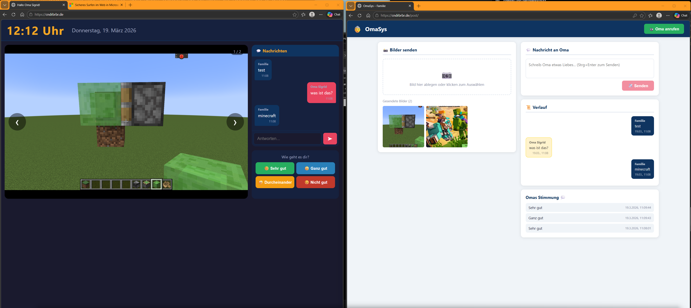

# OmaSys



A self-hosted family communication system designed for elderly relatives. Send photos and messages, make video calls, and greet Oma Sigrid every morning — all in real time.

## System Overview

```
┌─────────────────────────────────────────────┐
│               Docker Server                  │
│  Node.js · Express · Socket.io · SQLite      │
│  JWT Auth · Rate Limiting · Helmet CSP       │
└────────────┬──────────────────┬──────────────┘
             │  JWT (30 days)   │  JWT (7 days)
    ┌────────▼───────┐  ┌───────▼────────┐
    │    OmaGUI      │  │    PostGUI     │
    │  (yourdomain/) │  │  (/post)       │
    │                │  │                │
    │  PIN login     │  │  Password      │
    │  Clock & Date  │  │  Upload photos │
    │  Photo display │  │  Send messages │
    │  Chat messages │  │  See reactions │
    │  Mood buttons  │  │  Call Oma      │
    │  Video call    │  │                │
    │  Morning       │  │                │
    │  greeting      │  │                │
    └────────────────┘  └────────────────┘
```

- **OmaGUI** — full-screen, large-font display for Oma. Runs in the browser on her device (tablet, TV stick, PC). Protected by a numeric PIN.
- **PostGUI** — interface for family members to send photos, messages and make calls. Protected by password.
- **Morning greeting** — every day at 08:00 the server sends a "Guten Morgen, Oma Sigrid!" overlay to OmaGUI automatically.
- **Video calls** — powered by [Jitsi Meet](https://meet.jit.si) (free, no account needed). Both sides join the same room.

---

## Requirements

- Docker + Docker Compose
- A domain pointing to your server (for HTTPS / video calls)
- Open ports: `80` and `443` (with Caddy) or just your chosen port (without)

---

## Setup

### 1. Clone the repository

```bash
git clone https://github.com/cndrbrbr/omasys.git
cd omasys
```

### 2. Edit `config.yml`

```yaml
domain: oma.yourdomain.de   # your domain or server IP
port: 3000                  # port used when running without Caddy
password: changeme          # PostGUI login password for family
oma_pin: 1234               # PIN for OmaGUI (numeric, 4–8 digits)
jwt_secret: change-me       # long random secret for JWT signing — CHANGE THIS
caddy: false                # set to true to enable HTTPS via Caddy
```

> **Important:** Change `jwt_secret` to a long random string before going live. If it stays as the default, anyone can forge tokens.

### 3. Start

```bash
chmod +x start.sh
./start.sh
```

Or with command line overrides:

```bash
./start.sh --caddy          # enable Caddy (HTTPS)
./start.sh --no-caddy       # disable Caddy (direct HTTP)
./start.sh --build          # rebuild Docker image
./start.sh --caddy --build  # rebuild + enable Caddy
./start.sh down             # stop everything
```

---

## Usage

### OmaGUI — `https://yourdomain.de/`

Open this in Oma's browser. Best used in fullscreen mode (`F11`).

On first visit, Oma enters her PIN on a large numpad. The browser remembers her for 30 days — she won't need to enter it again unless she clears her browser data.

| Element | Description |
|---|---|
| PIN screen | Large numpad on first visit, auto-submits after 4 digits |
| Clock | Current time and date in German |
| Photo display | Shows photos sent by family, auto-advances every 8 seconds |
| Chat | Messages from family. Oma can type replies. |
| Mood buttons | Oma can send her mood (Sehr gut / Ganz gut / Durcheinander / Nicht gut) |
| Videoanruf | Starts/joins a Jitsi video call |
| Morning greeting | Full-screen overlay appears at 08:00 every day |

### PostGUI — `https://yourdomain.de/post`

Login with the password from `config.yml`. The browser remembers the session for 7 days.

| Feature | Description |
|---|---|
| Photo upload | Drag & drop or click to select. Add a caption, send to Oma. |
| Message | Send a text message. Oma can reply. |
| History | Full conversation history between family and Oma. |
| Oma's mood | Latest mood reactions from Oma with timestamps. |
| Oma anrufen | Sends Oma a call notification and opens Jitsi video call. |

---

## Security

Both interfaces are protected with JWT tokens issued by the server.

| | Method | Token lifetime |
|---|---|---|
| OmaGUI | 4–8 digit PIN | 30 days |
| PostGUI | Password | 7 days |

**What is protected:**
- All API endpoints require a valid JWT (except `/api/status` used by the Docker healthcheck)
- Socket.io connections require a valid JWT in the handshake
- Oma's role cannot access family-only endpoints (posting photos, sending messages as Familie)
- Rate limiting: 10 login attempts per 15 minutes per IP; 50 uploads and 100 messages per hour
- Security headers via Helmet (including Content Security Policy)

**Before going live, change these in `config.yml`:**
```yaml
password: your-strong-password
oma_pin: 5678
jwt_secret: some-very-long-random-string-nobody-can-guess
```

---

## HTTPS / Video Calls

Camera and microphone access requires HTTPS. Set `caddy: true` in `config.yml` and point your domain's DNS A-record to your server IP. Caddy fetches a Let's Encrypt certificate automatically.

```yaml
domain: oma.yourdomain.de
caddy: true
```

```bash
./start.sh --caddy --build
```

> When using Caddy, ports 80 and 443 must be open on your server firewall.

---

## Data & Persistence

All data is stored in a Docker volume (`omasys_data`):

- `omasys.db` — SQLite database (messages, reactions, photo metadata)
- `uploads/` — uploaded photo files

Data survives container restarts. To back up:

```bash
docker run --rm -v omasys_omasys_data:/data -v $(pwd):/backup alpine \
  tar czf /backup/omasys-backup.tar.gz /data
```

---

## Updating

```bash
git pull
./start.sh --build
```

---

## Configuration Reference

| `config.yml` key | Default | Description |
|---|---|---|
| `domain` | `yourdomain.de` | Hostname for URLs and Caddy certificate |
| `port` | `3000` | Exposed port when running without Caddy |
| `password` | `changeme` | PostGUI login password |
| `oma_pin` | `1234` | OmaGUI PIN (numeric) |
| `jwt_secret` | *(weak default)* | Secret for signing JWT tokens — **must be changed** |
| `caddy` | `false` | Enable Caddy reverse proxy with automatic HTTPS |
